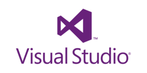

## Hi there, I'm Ivan Nižić 👋
Welcome to my GitHub profile! I'm software developer with more then 5 years of experience. Currently I professionally work as .NET engineer. Here's a bit about me:

### 🎓 Education
- Master degree in computer science, University of Split, Croatia

### 🛠️ Skills
- **Programming languages**:&ensp;&ensp;&ensp;
- **Web development**:&ensp;&ensp;&ensp;
- **Databases**:
- **Embedded programming**:&ensp;
- **Platforms**:&ensp;
- **Tools**: &ensp;&ensp;
- **Automotive protocols**:&ensp;&ensp;&ensp;, UDS, DoIP

### 💬 Connect with me
  &emsp;
 

<!--
TODO:
- Dodati slike za jezike, alate, fakultet, pogledati na https://github.com/ipazanin#what-do-i-do
- Dodati certifikate kao što je Vlado https://github.com/vladopandzic 📜 Certifications
-->
